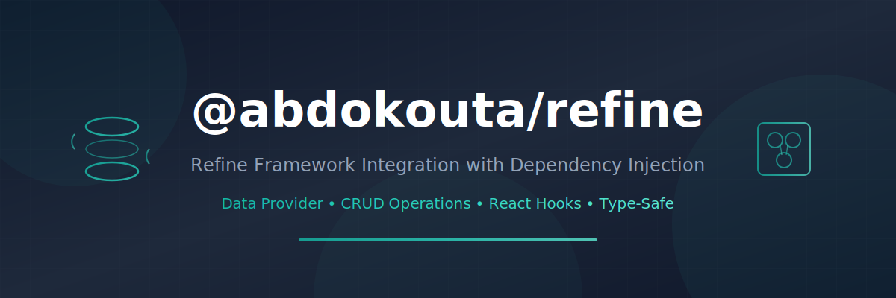

<p align="center">
  
</p>

<h1 align="center">@abdokouta/react-redis</h1>

<p align="center">
  <strong>Client-side Redis with multiple named connections for React</strong>
</p>

<p align="center">
  <a href="https://www.npmjs.com/package/@abdokouta/react-redis"></a>
  <a href="https://www.npmjs.com/package/@abdokouta/react-redis"></a>
  <a href="https://github.com/pixielity-inc/react-redis/blob/main/LICENSE"></a>
</p>

<p align="center">
  Upstash HTTP API • Multiple Named Connections • DI Integration • React Hooks
</p>

---

## What is this?

A Redis connection manager for browser-based React apps using the Upstash HTTP
REST API. Manage multiple named connections (cache, session, rate-limiting) with
lazy initialization, automatic caching, and lifecycle hooks.

Built on `MultipleInstanceManager` from `@abdokouta/react-support` and
integrates with `@abdokouta/ts-container` for NestJS-style dependency injection.

## Features

- Multiple named Redis connections (cache, session, etc.)
- Lazy connection resolution — created on first use, cached after
- Async deduplication — concurrent requests share one Promise
- `OnModuleInit` / `OnModuleDestroy` lifecycle hooks
- Custom connector support via `extend()`
- React hooks: `useRedis()`, `useRedisConnection()`
- Browser-compatible (Upstash HTTP, no TCP)
- Full TypeScript support

## Installation

```bash
pnpm add @abdokouta/react-redis @abdokouta/ts-container @abdokouta/react-support reflect-metadata
```

For React hooks, also install:

```bash
pnpm add @abdokouta/ts-container-react
```

## Quick Start

### 1. Configure connections

```typescript
// config/redis.config.ts
import { defineConfig } from '@abdokouta/react-redis';

export default defineConfig({
  default: 'main',
  connections: {
    main: {
      url: import.meta.env.VITE_UPSTASH_REDIS_REST_URL,
      token: import.meta.env.VITE_UPSTASH_REDIS_REST_TOKEN,
    },
    cache: {
      url: import.meta.env.VITE_UPSTASH_CACHE_REST_URL,
      token: import.meta.env.VITE_UPSTASH_CACHE_REST_TOKEN,
    },
  },
});
```

### 2. Register the module

```typescript
import { Module } from '@abdokouta/ts-container';
import { RedisModule } from '@abdokouta/react-redis';
import redisConfig from './config/redis.config';

@Module({
  imports: [RedisModule.forRoot(redisConfig)],
})
export class AppModule {}
```

### 3. Use in services

```typescript
import { Injectable, Inject } from '@abdokouta/ts-container';
import { RedisManager } from '@abdokouta/react-redis';

@Injectable()
export class UserService {
  constructor(@Inject(RedisManager) private redis: RedisManager) {}

  async getUser(id: string) {
    const conn = await this.redis.connection('cache');
    const cached = await conn.get(`user:${id}`);
    return cached ? JSON.parse(cached) : null;
  }

  async cacheUser(user: User) {
    const conn = await this.redis.connection('cache');
    await conn.set(`user:${user.id}`, JSON.stringify(user), { ex: 3600 });
  }
}
```

### 4. Use in React components

```tsx
import { useRedis } from '@abdokouta/react-redis';

function CacheDemo() {
  const redis = useRedis();

  const handleSet = async () => {
    const conn = await redis.connection('cache');
    await conn.set('greeting', 'Hello from Redis!', { ex: 60 });
  };

  const handleGet = async () => {
    const conn = await redis.connection('cache');
    const value = await conn.get('greeting');
    console.log(value);
  };

  return (
    <div>
      <button onClick={handleSet}>Set</button>
      <button onClick={handleGet}>Get</button>
    </div>
  );
}
```

## API

### RedisModule

```typescript
RedisModule.forRoot(config: RedisConfig): DynamicModule
```

Registers the `RedisManager`, connector, and config as providers. Set
`isGlobal: true` (default) to make Redis available to all modules.

### RedisManager

The main entry point. Extends `MultipleInstanceManager<RedisConnection>`.

| Method                       | Description                              |
| ---------------------------- | ---------------------------------------- |
| `connection(name?)`          | Get a connection by name (async, cached) |
| `disconnect(name?)`          | Disconnect and remove from cache         |
| `disconnectAll()`            | Disconnect all active connections        |
| `getConnectionNames()`       | All configured connection names          |
| `getDefaultConnectionName()` | The default connection name              |
| `isConnectionActive(name?)`  | Check if a connection is cached          |
| `getActiveConnectionNames()` | All currently active connection names    |
| `extend(driver, creator)`    | Register a custom connector              |

### RedisConnection

The connection interface returned by `connection()`.

| Method                         | Description                     |
| ------------------------------ | ------------------------------- |
| `get(key)`                     | Get a value                     |
| `set(key, value, options?)`    | Set a value (with optional TTL) |
| `del(...keys)`                 | Delete keys                     |
| `exists(...keys)`              | Check if keys exist             |
| `expire(key, seconds)`         | Set TTL                         |
| `ttl(key)`                     | Get remaining TTL               |
| `mget(...keys)`                | Get multiple values             |
| `mset(data)`                   | Set multiple values             |
| `incr(key)` / `incrby(key, n)` | Increment                       |
| `decr(key)` / `decrby(key, n)` | Decrement                       |
| `pipeline()`                   | Create a pipeline for batching  |
| `eval(script, keys, args)`     | Execute Lua script              |
| `flushdb()`                    | Delete all keys                 |
| `disconnect()`                 | Close connection                |

### React Hooks

| Hook                        | Description                        |
| --------------------------- | ---------------------------------- |
| `useRedis()`                | Get the `RedisManager` instance    |
| `useRedisConnection(name?)` | Get a connection (returns Promise) |

### DI Tokens

| Token             | Description                               |
| ----------------- | ----------------------------------------- |
| `REDIS_CONFIG`    | The configuration object                  |
| `REDIS_CONNECTOR` | The connector (creates connections)       |
| `REDIS_MANAGER`   | The RedisManager (symbol-based injection) |

## Configuration

```typescript
interface RedisConfig {
  default: string; // Default connection name
  connections: Record<
    string,
    {
      url: string; // Upstash REST URL
      token: string; // Upstash REST token
      retry?: { retries?: number; backoff?: (n: number) => number };
      timeout?: number; // Request timeout (ms)
      enableAutoPipelining?: boolean; // Auto-batch commands
    }
  >;
  isGlobal?: boolean; // Register globally (default: true)
}
```

## Lifecycle

The `RedisManager` implements lifecycle hooks:

- `OnModuleInit` — eagerly warms the default connection on bootstrap
- `OnModuleDestroy` — disconnects all active connections on `app.close()`

## Multiple Connections

```typescript
// Each connection is independent — different Upstash instances
const main = await redis.connection('main');
const cache = await redis.connection('cache');
const session = await redis.connection('session');

// Connections are cached — second call returns instantly
const same = await redis.connection('cache'); // same instance as above
```

## Custom Connectors

```typescript
// Register a custom connector for a different Redis client
redis.extend('ioredis', (config) => {
  return new MyIoRedisConnection(config);
});
```

## Environment Variables

```env
VITE_UPSTASH_REDIS_REST_URL=https://your-redis.upstash.io
VITE_UPSTASH_REDIS_REST_TOKEN=your-token
VITE_UPSTASH_CACHE_REST_URL=https://your-cache.upstash.io
VITE_UPSTASH_CACHE_REST_TOKEN=your-cache-token
VITE_UPSTASH_SESSION_REST_URL=https://your-session.upstash.io
VITE_UPSTASH_SESSION_REST_TOKEN=your-session-token
```

## Vercel KV

Vercel KV is Upstash under the hood. Just use the KV credentials:

```typescript
defineConfig({
  default: 'kv',
  connections: {
    kv: {
      url: process.env.KV_REST_API_URL,
      token: process.env.KV_REST_API_TOKEN,
    },
  },
});
```

## License

MIT

---

<p align="center">
  Made with ❤️ by <a href="https://github.com/abdokouta">Abdo Kouta</a> at <a href="https://github.com/pixielity-inc">Pixielity</a>
</p>
